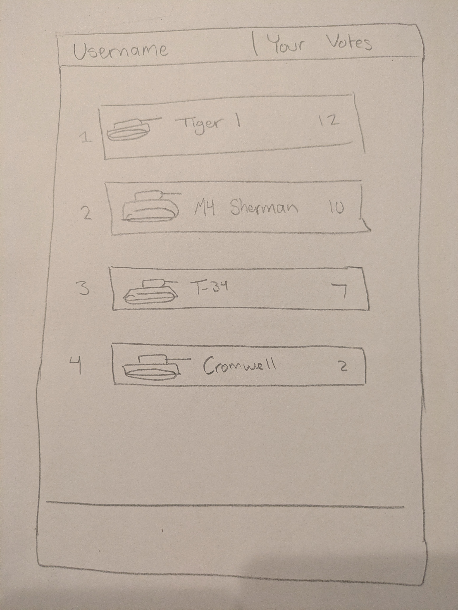

# CS 260 Notes

[My startup - Simon](https://simon.cs260.click)

## Helpful links

- [Course instruction](https://github.com/webprogramming260)
- [Canvas](https://byu.instructure.com)
- [MDN](https://developer.mozilla.org)

## AWS

My IP address is: 54.81.96.130
Launching my AMI I initially put it on a private subnet. Even though it had a public IP address and the security group was right, I wasn't able to connect to it.

## Caddy

No problems worked just like it said in the [instruction](https://github.com/webprogramming260/.github/blob/main/profile/webServers/https/https.md).

## HTML

This was easy. I was careful to use the correct structural elements such as header, footer, main, nav, and form. The links between the three views work great using the `a` element.

The part I didn't like was the duplication of the header and footer code. This is messy, but it will get cleaned up when I get to React.

## CSS

This took a couple hours to get it how I wanted. It was important to make it responsive and Bootstrap helped with that. It looks great on all kinds of screen sizes.

Bootstrap seems a bit like magic. It styles things nicely, but is very opinionated. You either do, or you do not. There doesn't seem to be much in between.

I did like the navbar it made it super easy to build a responsive header.

```html
      <nav class="navbar navbar-expand-lg bg-body-tertiary">
        <div class="container-fluid">
          <a class="navbar-brand">
            
            Calmer
          </a>
          <button class="navbar-toggler" type="button" data-bs-toggle="collapse" data-bs-target="#navbarSupportedContent">
            <span class="navbar-toggler-icon"></span>
          </button>
          <div class="collapse navbar-collapse" id="navbarSupportedContent">
            <ul class="navbar-nav me-auto mb-2 mb-lg-0">
              <li class="nav-item">
                <a class="nav-link active" href="play.html">Play</a>
              </li>
              <li class="nav-item">
                <a class="nav-link" href="about.html">About</a>
              </li>
              <li class="nav-item">
                <a class="nav-link" href="index.html">Logout</a>
              </li>
            </ul>
          </div>
        </div>
      </nav>
    </header>
```

I also used SVG to make the icon and logo for the app. This turned out to be a piece of cake.

```html
<svg width="100" height="100" xmlns="http://www.w3.org/2000/svg">
  <rect width="100" height="100" fill="#0066aa" rx="10" ry="10" />
  <text x="50%" y="50%" dominant-baseline="central" text-anchor="middle" font-size="72" font-family="Arial" fill="white">C</text>
</svg>
```

## React Part 1: Routing

Setting up Vite and React was pretty simple. I had a bit of trouble because of conflicting CSS. This isn't as straight forward as you would find with Svelte or Vue, but I made it work in the end. If there was a ton of CSS it would be a real problem. It sure was nice to have the code structured in a more usable way.

## React Part 2: Reactivity

This was a lot of fun to see it all come together. I had to keep remembering to use React state instead of just manipulating the DOM directly.

Handling the toggling of the checkboxes was particularly interesting.

```jsx
<div className="input-group sound-button-container">
  {calmSoundTypes.map((sound, index) => (
    <div key={index} className="form-check form-switch">
      <input
        className="form-check-input"
        type="checkbox"
        value={sound}
        id={sound}
        onChange={() => togglePlay(sound)}
        checked={selectedSounds.includes(sound)}
      ></input>
      <label className="form-check-label" htmlFor={sound}>
        {sound}
      </label>
    </div>
  ))}
</div>
```

git pull
git commit
git push
ctrl + shift + g for source control (GUI)
<!--  --> image in markdown

## HTML Structure

<body>
  <p>Body</p>
  <header>
    <h1>Isaac Garner</h1>
    <nav>Navigation
      <div><a href=" https://www.byu.edu/ "> BYU </a></div>
      <div><a href=" https://www.familysearch.org/en/united-states/ "> FamilySeach </a></div>
    </nav>
  </header>

  <main>
    <section>
      <p>Section</p>
      <ul>
        <li>Apples</li>
        <li>Bananas</li>
        <li>Oranges</li>
      </ul>
    </section>
    <section>
      <p>Section</p>
      <table>
        <tr>
          <th>Table</th>
          <th>Table</th>
          <th>Table</th>
        </tr>
        <tr>
          <td>table</td>
          <td>table</td>
          <td>table</td>
        </tr>
        <tr>
          <td>HTML</td>
          <td>CSS</td>
          <td>JavaScript</td>
        </tr>
      </table>
    </section>
    <aside>
      <p>Aside</p>
      
    </aside>
  </main>

  <footer>
    <a href=" https://github.com/ByPass077/startup "> My Github Repository </a>
  </footer>
</body>


## HTML Input

<body>
  <h1>Example Form</h1>
  <form action="formSubmit.html" method="post">
    <ul>
      <li>
        <!-- Includes validation-->
        <label for="text">Text: </label>
        <input type="text" id="text" name="varText" placeholder="text here" required pattern="[Aa].*" />
      </li>
      <li>
        <label for="password">Password: </label>
        <input type="password" id="password" name="varPassword" />
      </li>
      <li>
        <label for="email">Email: </label>
        <input type="email" id="email" name="varEmail" />
      </li>
      <li>
        <label for="textarea">TextArea: </label>
        <textarea id="textarea" name="varTextarea"></textarea>
      </li>
      <li>
        <label for="select">Select: </label>
        <select id="select" name="varSelect">
          <option>option1</option>
          <option selected>option2</option>
          <option>option3</option>
        </select>
      </li>
      <li>
        <label for="optgroup">OptGroup: </label>
        <select id="optgroup" name="varOptGroup">
          <optgroup label="group1">
            <option>option1</option>
            <option>option2</option>
          </optgroup>
        </select>
      </li>
      <li>
        <fieldset>
          <legend>checkbox</legend>
          <label for="checkbox1">checkbox1</label>
          <input type="checkbox" id="checkbox1" name="varCheckbox" value="checkbox1" />
        </fieldset>
      </li>
      <li>
        <fieldset>
          <legend>radio</legend>
          <label for="radio1">radio1</label>
          <input type="radio" id="radio1" name="varRadio" value="radio1" checked />
        </fieldset>
      </li>
      <li>
        <!-- Submit form with POST method and enctype="multipart/form-data" to send file contents. -->
        <label for="file">File: </label>
        <input type="file" id="file" name="varFile" accept="image/*" multiple />
      </li>
      <li>
        <label for="search">Search: </label>
        <input type="search" id="search" name="varSearch" />
      </li>
      <li>
        <label for="tel">Tel: </label>
        <input type="tel" id="tel" name="varTel" placeholder="###-####" pattern="\d{3}-\d{4}" />
      </li>
      <li>
        <label for="url">URL: </label>
        <input type="url" id="url" name="varUrl" />
      </li>
      <li>
        <label for="number">Number: </label>
        <input type="number" name="varNumber" id="number" min="1" max="10" step="1" />
      </li>
      <li>
        <label for="range">Range: </label>
        <input type="range" name="varRange" id="range" min="0" max="100" step="1" value="0" />
        <output id="rangeOutput" for="range">0</output>
        <!-- Range requires some JavaScript in order to make it work. Ignore this for now. -->
        <script>
          const range = document.querySelector('#range');
          const rangeOutput = document.querySelector('#rangeOutput');
          range.addEventListener('input', function() {
            rangeOutput.textContent = range.value;
          });
        </script>
      </li>
      <li>
        <label for="progress">Progress: </label>
        <progress id="progress" max="100" value="75"></progress>
      </li>
      <li>
        <label for="meter">Meter: </label>
        <meter id="meter" min="0" max="100" value="50" low="33" high="66" optimum="50"></meter>
      </li>
      <li>
        <label for="datetime">DateTime: </label>
        <input type="datetime-local" name="varDatetime" id="datetime" />
      </li>
      <li>
        <label for="time">Time: </label>
        <input type="time" name="varTime" id="time" />
      </li>
      <li>
        <label for="month">Month: </label>
        <input type="month" name="varMonth" id="month" />
      </li>
      <li>
        <label for="week">Week: </label>
        <input type="week" name="varWeek" id="week" />
      </li>
      <li>
        <label for="color">Color: </label>
        <input type="color" name="varColor" id="color" value="#FF0000" />
      </li>
      <!-- This doesn't show up to the user, but allows the form to send associated data. -->
      <input type="hidden" id="secretData" name="varSecretData" value="1989 - the web was born" />
    </ul>

    <button type="submit">Submit</button>
  </form>
</body>